# **Holy Grail Controller 仕様書**

## **0.用語の説明**

ss：シャッター速度  
iso：iso感度  
fn ：f値  
ev ：露出補正  
AP ：アクセスポイント。Wi-Fiを接続する際の接続先。  
エッジ端末：  
- スマートフォンから撮影計画を転送した「M5Stack CoreS3」をカメラと接続してHolyGrailの撮影がおこなえる。  
- スマートフォンを長時間占有することなくHolyGrail撮影がおこなえる。  
- 現状はM5Stackだけだが将来他にも広げる可能性があるので抽象的に「エッジ端末」と呼ぶ。

制御端末：  
* HolyGrai撮影をする際のスマートフォンもしくはエッジ端末を総称して制御端末と呼ぶ。   

リニア輝度：  
- ヒストグラムの中央値に対してsRGV逆補正をかけて補正前の値に変換したもの。  

## **1\. 全体像**

## **1.0.概要**

星景から日の出等、光量変化が大きい時間帯のタイムラプス撮影は露出の調整が困難である。  
その実現困難なことから Holy Grail と呼ばれる。  
この仕様書はこの Holy Grail タイムラプス撮影を自動でおこなうアプリケーションの仕様書である。  
アプリケーション内で作成した撮影計画に則ってカメラを制御しタイムラプス撮影をおこなう。

## **1.1.使いかた**

アプリケーションの使われ方を説明する。

### **1.1.1.スマートフォン単体で**

スマ－トフォンのカメラによっては夜間でも撮影することが可能である。  
そのようなカメラを備えているスマートフォンでは Holy Grail の撮影がおこなえる。  
撮影計画をあらかじめ作成、もしくは撮影現場で撮影計画を作成する。  
スマートフォン自体を三脚などに固定し撮りたいアングルを決める。  
撮影を開始する。  
長時間撮影をおこなう際にはモバイルバッテリなどで電源を確保する。  
  

### **1.1.2.スマートフォンでカメラを制御**

スマ－トフォンで撮影計画を作成する。  
開始時刻と終了時刻、撮影場所の緯度経度、標高を指定すると自動的に撮影計画を作成する。  
星景、日の出などを撮影する現場に行き、カメラとスマートフォンを接続する。  
スマ－トフォンから撮影開始の指示を与えると撮影計画に則ってカメラを操作し撮影を開始する。  
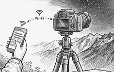

### **1.1.3.エッジ端末でカメラを制御**

長時間の撮影を行う際に人が常に見ていることが難しい場合がある。  
スマートフォンは情報端末でありセキュリティ的に重要な情報が入っていることが多い。  
エッジ端末であれば重要なセキュリティ情報は入っておらず万が一の盗難にあってもスマートフォンを失うよりは被害を軽減できる。
そのためエッジ端末からカメラを制御することも可能な仕様とする。  
エッジ端末はLCDが小さく入力操作が困難なので基本的にはスマートフォンから受信した撮影計画は変更できないこととする。  
撮影計画を表示し、実行/停止のみが行えることとする。
使用方法としては、スマ－トフォンで作成した撮影計画をエッジ端末に送る。  
エッジ端末で撮影計画を選択し撮影の開始/停止操作をおこなう。  
この際、スマートフォンにも今の撮影状況を表示したり、スマ－トフォンから開始/停止の指示を行う事も可能。  
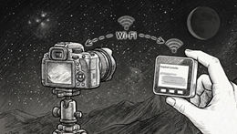  

### **1.1.4.複数台カメラ制御**

撮影計画を複数作成し同時に複数台のカメラを操作して撮影することができる。  
複数台の撮影をする方法としては以下がある。  
・エッジ端末をAPにする。  
・スマートフォンのテザリング機能を使用する  
・トラベルルーターを使用する  

ただし、モーションタイムラプスとした際には制御端末のセンサー情報をリアルタイムで取集しカメラの方位を計算する。  
そのため、制御端末とカメラは1対1に制限される。  

## **1.2.カメラとの接続方法**

### **1.2.1.エッジ端末を AP とする使いかた**

エッジ端末をアクセスポイントモードで起動する。  
カメラとスマートフォンをエッジ端末のSSIDに接続する。  
スマ－トフォンからの指示で撮影を開始する。  
エッジ端末をAPとした際に接続できるカメラは2台までとなる。  
（何台のカメラを安定して制御できるかは実験して確かめる）

### **1.2.2.スマートフォンのテザリングを利用した使い方**

スマートフォンのテザリング機能を有効にする。  
エッジ端末とカメラはスマートフォンのSSIDに接続する。  
エッジ端末をAPとした際に接続できるカメラは2台までとなる。  
（何台のカメラを安定して制御できるかは実験して確かめる）

### **1.2.2.トラベルルーターを利用した使い方**
トラベルルーターをAPとして各デバイスを接続すると安定した通信が可能となる。  
カメラとスマートフォン、エッジ端末をAPに接続する。

### **1.2.3.カメラを AP とする使い方**
カメラをAPとする。  
この場合はカメラに接続できるデバイスは1台のみとなる。  
スマートフォンの Wi-Fi 設定で接続する。  
もしくはあらかじめ別の方法で接続したエッジ端末をカメラのAPに接続して使用する。  
この場合はエッジ端末とスマートフォンは通信できないこととする。  

## **2\. 撮影計画**

### **2.1. 撮影計画について**

・開始と終了の日付時刻、撮影場所、撮影方向、カメラ、レンズを選択する。  
・これらをもとに撮影計画を自動で作る。  
・撮影計画は時間帯による撮影制御方法の組み合わせである。  

### **2.2. 撮影計画自動生成**

#### **2.2.1.概要**
撮影計画を自動生成する。  
別途説明する「撮影制御方法」を組み合わせて実現させる。  
入力された情報から月齢、月の出入り、日の出入りの時刻方位を求める。  
あらかじめ設定で作成した撮影制御方法を組み合わせる。  
撮影計画ごとに必要な情報は変更可能とする。  

#### **2.2.2.撮影計画生成の方法**
撮影計画の入力としては以下のものがある。  
- 開始日時
- 終了日時
- 撮影方向(方位、仰角)
- カメラ情報から得たセンサーサイズ(pixel, mm)
- カレンズ情報から得た焦点距離

これらのパラメータをもとに以下撮影制御方法の開始、終了時刻を計算する。  
- 「夜間撮影」
- 「日中」
- 「朝日撮影」
- 「夕日撮影」

算出した時刻をもとにスケジュールを組み立てる。  
月を直接撮影する際にも時刻を計算できるがこれは「月の影響への対処」で設定することとする。  

#### **2.2.2.不連続点の解消**
暗くなっていく夕暮れの時間帯は自動露出制御をおこなっているが自動制御では「夜間撮影」に収束しない。  
そのため「日中」と「夜間撮影」の間に「夜間前移行」を設け「夜間撮影」になめらかに変化するように露出設定の調整をする。  
「夜間前移行」についてはユーザーが設定できる項目は無い。
また同様に夜間撮影から次の撮影制御方法までの時間帯は薄明の状態が刻一刻と変化する。  
そのため次の撮影制御方法に近づけていくための「夜間後移行」を設けてなめらかな露出制御をおこなう。  

#### **2.2.3.撮影周期**
撮影周期の初期値はすべての撮影制御方法の中で最大の ss から算出する。
外部カメラを使用する際には最大 ss + 2秒、スマートフォンの場合は +10 秒とする。
これが最小の撮影周期となる。  
これより短い撮影周期は設定できない。  

#### **2.2.4.自動で選択される設定**
以下の設定は初期値として自動で選択される。
- カメラ
- レンズ
- 撮影制御方法

これらの設定で「撮影計画に自動的に挿入する」のチェックを入れている物が撮影計画新規作成時に使用される。  
撮影計画内で別の設定に変更できる。  

### **2.3. 撮影計画編集**
デフォルトの撮影計画を編集することができる。  
新規に撮影計画を作成し編集することができる。  
撮影計画は名前を付けて保存できる。  
撮影計画は撮影制御方法の組み合わせで作成する。  
あらかじめ撮影制御方法で指定した内容が初期値として設定される。  
大気の状態や周辺の明るさなどに影響される項目は撮影計画ごとに変更する。  

#### **2.3.1.撮影計画固有の設定**
星景撮影や月の撮影のために撮影制御方法を指定している。
しかし、撮影当日の大気の状態やその場でしか分からない周囲の明るさのために設定を変更する必要が発生する可能性がある。  
また撮りたい動画のフレームレートなどはその都度変更する可能性がある。  
そのような際には全体に影響を及ぼす撮影制御方法を変えるのではなく撮影計画個別に設定を変更する。  

■撮影周期  
　撮影周期はNPFルールで自動計算される。  
　この周期が初期値として表示されるが撮影計画ごとに変更可能である。  

■星景撮影設定  
　F値、ISO感度、SSは大気の状態や周辺の明るさなどに応じて変更する。

### **2.4. NPFルールのシャッター速度**  
星景撮影時は地球の自転のためssを長くすると星が流れてしまう。  
星が流れないように星景タイムラプスを撮影するにはこの星が流れないssで撮影をする必要がある。  
ただし、これは参考に表示しているだけで他の制御には影響はない。  
星が流れるように撮影するのも、街を撮るためにssを短くするのもユーザーの選択である。  
この星が流れない範囲の最大のシャッター速度をNPFルールで算出し表示する。  
対象のカメラごとのパラメータの取得方法と具体的な数値を用いた計算例を提示する。  

((35 × F値) ＋ ( 30,000 × [センサーサイズmm] / [ピクセル数])) / [焦点距離]

#### **2.4.1.一眼レフやミラーレスカメラ**  
APSC 機である EOS-R10 では以下のようになる。  
レンズは Sigma CONTENPORARY 12mm F1.4 DC を想定  
| 項目  | 値 |   
| :---: | :--:|  
| F値 | 1.4|  
| 焦点距離 | 12mm|  
| センサーサイズ | 22.5mm|  
| センサー画素数`[横]` |6000pixel|  

　((35 × 1.4) ＋ (30000 × 22.5 / 6000)) / 12  
　＝ (49 ＋ 112.5) / 12 ＝　13.45`[秒]`  

この時間よりも短い最大の設定可能な時間をシャッター速度とする。  
EOS-R10 の場合は13秒である。  
2秒をその他の処理時間とし最小の撮影周期は15秒とする。

#### **2.4.2.Android端末**  
google pixel8 を例に説明する。
| 項目  | 値 |   
| :---: | :--:|  
| 焦点距離 | 6.90|  
| F値 | 1.68|  
| センサーサイズ | 9.82mm|  
| センサー画素数`[横]`| 8,160pixel|  

■これを NPF ルールの式に当てはめる。  
((35 × F値) ＋ ( 30,000 × [センサーサイズmm] / [ピクセル数])) / [焦点距離]

((35 × 1.68)) ＋ ( 30000 × 9.82mm/ 8,160)) / 6.90mm  
＝ (58.8 ＋ 36.1) / 6.90 
＝ 13.75`[秒]`  
  
android端末のカメラAPIではシャッター速度は自由に設定できるのでこの時間をそのまま設定する。  
また、撮影を連続しておこなうと熱によるノイズやcpu自体の熱暴走の危険があるため撮影周期はシャッター速度+10秒を最小時間とする。  

#### **2.4.3.iPhone**  
具体的にiPhone 15 Proを例に説明する。
| 項目  | 値 |   
| :---: | :--:|  
| F値 | 1.78|  
| 画角 | 70.8°|  
| 焦点距離 | 6.765mm|  
| センサー画素数`[横]` | 8064pixel|  

■センサーのサイズをAPIで取得できないため画角と焦点距離から求める。  

[センサーサイズ]　＝　2　×　[焦点距離]　×　tan(([画角]×π/180)　/　2)
  
2 × 6.765 × tan((70.8 × 3.14/180)/2)  
9.6mm  ＝　2 × 6.765 × 0.71

■これを NPF ルールの式に当てはめる。  

((35 × F値) ＋ ( 30,000 × [センサーサイズmm] / [ピクセル数])) / [焦点距離]

((35 × 1.78)) ＋ ( 30000 × 9.6mm/ 8061)) / 6.765mm  
＝ (62.3 ＋ 35.73) / 6.765 
＝ 14.5`[秒]`  
  
iPhoneの場合は長時間のシャッター速度の設定がおこなえない事が多い。  
そのため設定可能な最大のシャッター速度で複数回の撮影をおこないその画像を加算する。  
NPFルールで求めた星を撮るためのシャッター速度に達するまで最長のシャッタ速度で撮影を繰り返す。  
その画像を加算して1枚の画像を生成する。  
撮影周期はAndroidと同様にNPFルールの時間プラス10秒とする。  

### **2.5. カメラ、レンズの選択**
NPFルールで星景撮影時のシャッター速度、最小の撮影周期を求めるためのパラメータをカメラごとに定義する。  
#### **2.5.1.一眼レフやミラーレスカメラの選択**
使用できるカメラは一覧から選択する。  
カメラの一覧はインストール時に初期値として持っているがサーバーを参照し最新版に更新することができる。  
また、一覧にないカメラをユーザーによって登録することができる。  
頻繁に使用するカメラ、レンズを所持機材としてすぐに利用できるようにする。  
また、カメラがonlineであればカメラから取得することが可能である。
onlineのカメラから取得する場合はレンズ情報も同時に取得する。
カメラの情報としては以下の値を持つ。  
- カメラ名称。  
- センサーサイズ。  
- センサーpixel数。  
- 設定可能なiso、ss。  

#### **2.5.2. 一眼レフやミラーレスのレンズ選択**
使用できるレンズは一覧から選択する。  
カメラと同様に頻繁に使用するレンズは所持機材としてすぐに利用できるようにする。  
レンズ情報からは以下の値をもつ。  
- レンズ名称  
- 焦点距離  
- F値 
- 電子接点有無  

#### **2.5.3.スマートフォンカメラの選択**
一眼レフやミラーレスカメラの選択肢に「BuiltIn」を用意する。  
「BuiltIn」はスマートフォン内蔵のカメラを意味する。  
スマートフォンは複数のカメラを持っていることが多いのでレンズ選択で指定する。

#### **2.5.4.スマートフォンのレンズ選択**
レンズの選択肢はカメラのAPIを使用して取得する。  
NPFルールで使用する以下パラメータについてもAPIを使用して取得する。  
一部の直接取得できないパラメータについては算出する。  
- カメラ名称：「BuiltIn」固定  
- センサーサイズ  
- センサーpixel数  
- レンズ名称  
- 焦点距離  
- F値  

## **3.撮影制御方法**

### **3.1. 概要**
撮影制御方法には以下がある。
- 夜間撮影  
- 夕日撮影
- 朝日撮影
- 日中撮影  
- 月の影響への対応  
- 夜間前移行  
- 夜間後移行  

撮影時刻に応じてこれらを使用した撮影計画を自動生成する。  
夜間撮影は固定露出となる。  
それ以外は自動露出である。  
「夜間前移行」以外の撮影制御方法は設定値を変更したユーザープリセットを保存できる。  

### **3.2. 夜間撮影**
太陽高度で夜間撮影の開始/終了の時刻を指定する。  
固定露出とし「夜間撮影」の間は変化させない。
「夜間撮影」に向かう夕暮れ時の薄明では前の撮影制御方法との間に「夜間前移行」が挿入される。  
同様に「夜間撮影」後は「夜間後移行」が挿入される。  

### **3.3. 朝日撮影**
日の出時刻に太陽を直接撮影するための撮影制御方法である。  
日の出またぐ時刻で画角に太陽が入る場合は「朝日撮影」とする。  
薄明の状態で開始/終了の時刻を設定する。  
基本的に「朝日撮影」はevをマイナスにする。  
iso, ss, fn の上下限と優先度を指定しその範囲で自動露出制御をおこなう。  
薄明の状態は太陽高度で指定する。  

### **3.4. 夕日撮影**
「朝日撮影」と同様に夕日の撮影する際に使用する撮影制御方法である。  
朝日撮影とは薄明の時系列が逆になるだけでそのほかは同等とする。  

### **3.5. 日中**
「日中撮影」の期間は自動露出である。  
初期値のevは±0である。  
日中は時間帯により明側からも暗側からも始まりうるため、開始時の初期値(iso/ss/fn)を**「明所限界／中間点／暗所限界」の3択**からユーザーが選ぶ。中間点は各軸の明所限界・暗所限界のAPEX中間に最も近い設定可能値とする。(朝日/夕日は明暗どちらから始まるか明確なため明所/暗所限界の2択。)  
iso, ss, fn の上下限と優先度を指定しその範囲で自動露出制御をおこなう。  

### **3.6. 月の影響への対応**
夜景撮影時に月が画角に入る、もしくは近くにあると露出設定の変更が必要である。  
これを自動で行うための設定である。  
大きく以下に分かれる。  
- 月を撮る目的の露出設定(H-G関数使用)
- 画角全体の明るさで露出設定
- 露出設定変更なし
この撮影制御方法は時間帯によって挿入されるものではない。  
夜間撮影中の月への影響に対処する方法を定義する。  

### **3.7. 夜間前移行**
自動露出の撮影制御方法から固定露出の「夜間撮影」に移行する期間に挿入される。  
景色が暗くなっていき夜間になっても自動露出制御では「夜間撮影」の設定には収束しない。  
そのため輝度から判断する露出制御を止めて「夜間撮影」に収束するように露出調整をする。  
1フレームにつき1/3段の露出設定を変更する。  
この方法で現在の露出設定から「夜間撮影」の露出設定になるまでのフレーム数を計算する。  
このフレーム数から求めた時刻が「夜間撮影」の開始時刻になっていたら「夜間前移行」を開始する。  
自動生成したスケジュールには「市民薄明」の終わりごろから「夜間前移行」を挿入しているがこれは大まかな目安である。  
実際の時刻とは合わない可能性が大きい。  

また、「朝日撮影」で終了の時刻が定められている。  
この時刻と「夜間撮影」の開始時刻が1/3段ずつの露出変更にかかる時間より長い場合は間に「日中撮影」が挿入される。  

### **3.8. データ保持形式**
撮影制御方法とプリセット、撮影計画のデータの関係を説明する。  
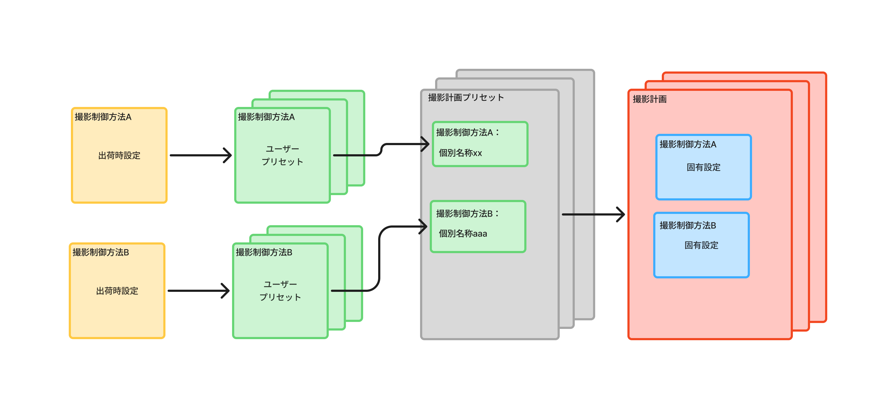
Figma: https://www.figma.com/board/BUoVGTRdPYdYwzUFs9evvC/flow%E6%92%AE%E5%BD%B1%E5%88%B6%E5%BE%A1%E6%96%B9%E6%B3%95?t=mx7wzmihBOpdJbj7-0  
撮影制御方法は初期値として出荷時設定を持つ。  
設定画面で頻繁に使用する撮影制御方法を複数作成しユーザー定義の撮影制御方法として保存することができる。  
これをユーザープリセットと呼ぶ。  
さらに夜間撮影や日の出撮影などの撮影制御方法の組み合わせをまとめて撮影計画プリセットを作成する。
撮影計画のプリセットには撮影制御方法の名称のみが関連付けられる。    
これも複数作成して保存できる。  
撮影計画は撮影計画プリセットを初期値として新規作成する。  
撮影制御方法は撮影計画内にコピーして保持される。  
撮影計画内の撮影制御方法は個別に変更できる。  

### **3.9. 夜間後移行**
固定露出の「夜間撮影」から次の自動露出の撮影制御に移行する期間に挿入される。  
この期間は**測光による自動露出**で制御する。露出の上限(暗所限界＝最も露出の多い側)を**夜間撮影の固定露出**にクランプし、下限(明所限界)・初期値・優先度は**次の撮影制御方法**に合わせる。目標evは夜間撮影で設定した「夜間後露出補正(postNightEv)」とする(次の撮影制御方法のevとは別に設定できる)。  
夜間露出から始まり、暗いうちは夜間露出のまま、明るくなった分だけ露出を下げていく。雲などの明暗変化にも追従する。  

## **4.撮影実行**

### **4.1.概要**
撮影計画に則って撮影を行う。  
ユーザーは撮影計画を指定して実行を指示する。  
自動露出の際は周囲の明るさを自動認識して適正な露出設定を行う。  
撮影間隔は最優先で守る。  
カメラからの情報の取得はシャッターが開いている間やデータ処理中には行えない。  
最低限のアクセスだけをアクセス可能な時間に行い解析などのデータ処理はカメラにアクセスできない時間帯に行う。  

### **4.2.設定可能範囲の取得**
撮影開始時にカメラから設定可能なiso,fn,ssを取得する。  
これらと対比する APEX 値のテーブルを作成する。  
APEX値は1/3段刻みで正確な値を持つ。  
カメラの設定値は近い切れのいい数字なので1/3段刻みの近い値をそれに当てはめる。  
■ iso  
1. log2(iso/100)で段数を求める。  
1. ±0.15の範囲に収まる1/3刻みのSvの位置に当てはめる。  
1. 以下テーブルを完成させる。  

| iso | Sv |  
| --- | -- |  
| 100 | 0.00 |  
| 125 | 0.33 |
| 160 | 0.67 |
| 200 | 1.00 |
| 250 | 1.33 |
| 320 | 1.67 |
| 400 | 2.00 |

■ fn  
1. log2(fn^2)で段数を求める。  
1. ±0.15の範囲に収まる1/3刻みのAvの位置に当てはめる。  
1. 以下テーブルを完成させる。  

| fn | Av |  
| --- | -- |  
| 1.0 | 0.00 |  
| 1.2 | 0.33 |
| 1.3 | 0.67 |
| 1.4 | 1.00 |
| 1.6 | 1.33 |
| 1.8 | 1.67 |
| 2.0 | 2.00 |
| 2.2 | 2.28 |

■ ss  
1. log2(1/ss)で段数を求める。  
1. ±0.15の範囲に収まる1/3刻みのAvの位置に当てはめる。  
1. 以下テーブルを完成させる。  

| ss | Tv |  
| --- | -- |  
| 2.5 | -1.33 |  
| 2.0 | -1.00 |  
| 1.6 | -0.67 |
| 1.3 | -0.33 |
| 1.0 | 0.00 |
| 0.8 | 0.33 |
| 0.6 | 0.67 |
| 0.5 | 1.00 |
| 0.4 | 1.33 |

### **4.3.明るさの認識**

ライブビューのヒストグラムから画角内の明るさを求める。  
取得したヒストグラムの輝度情報の中央値を明るさとする。  
ヒストグラムは最も明るい状況を1となるように0.0～1.0の値に最適化する。  
ヒストグラムはセンサーで取得したデータにsRGV(ガンマ)補正をかけたものである。  
sRGV逆補正(デガンマ)をかけてセンサーで取得した値に戻す。  
ev0はヒストグラム中央値がの0.18となる輝度である。  

#### **4.3.1.中央値の求め方**
中央値は全体の要素数÷2の位置である。  
中央値が入るbinの番号に以下の小数点以下の値を加算する。  
bin の数が 256 の場合を例に説明する。  

([全要素数] / 2) - [前のbinまでの要素数合計]) / [中央値のあるbinの要素数]

binの番号は暗い方からbin\[0\],bin\[1\]…bin\[255\] とする。  

全体の要素数が65,535、bin\[120\]までの要素数の合計が32,700、bin\[121\] の要素数が200とした場合、  

((65535 / 2\) \- 32,700) / 200 ≒ 0.34  

この時の中央値は約 121.3 となる。
これを bin の最大値 255 で割り1.0未満の値とする。  
0.476 = 121.3 ÷ 255

これをこの時の画角の明るさとする。

#### **4.3.2.sRGV 逆補正(デガンマ)**
ヒストグラムは人の感覚に合わせるためsRGV(ガンマ)補正されている。  
そのため逆ガンマ補正をかけて輝度をセンサー入力の数値とする。  
暗い部分と明るい部分で曲線が分かれているため以下2通りの計算式を使用する。  
ヒストグラムから求めたsRGV補正後の明るさを「 $x$ 」、sRGV補正前の明るさを「 $linear$ 」として以下説明をする。  
なお、sRGV補正前のヒストグラムの中央値を以後「リニア輝度」として説明する。  

■ $x$が　0.04045以下のとき  
  $linear$ = $x$ / 12.92

■ $x$が　0.04045を超えているとき  
  $linear$ = (( $x$ + 0.055)/ 1.055) ^ 2.4

今の明るさを $linear_n$、目標の明るさを $linear_t$ とした場合の $ev$ の差は以下の式で求められる。  

$ev$ = log2( $linear_t$ / $liner_n$ )&emsp;&emsp;……………&ensp;リニア輝度 to $ev$

逆に今の明るさを $linear_n$ としたとき $ev$の差から目標とするリニア輝度を求める式は以下となる。  
$linear_t$ = (2 ^ $ev$ ) × $linear_n$ &emsp;&emsp;……………&ensp; $ev$ to リニア輝度

朝日、夕日撮影で ev-2 などと暗めに設定する際はカメラの標準的な ev0 と比較してのev-2となる。  
カメラの標準的な ev0 はリニア輝度が 18% となる位置となっている。  
リニア輝度 0.18 からの露出補正である。  

2### **4.4. 最初の補正**
夜間撮影以外の自動露出の時間帯は撮影開始時の露出が定まっていない。  
そのためこれを求める方法を説明する。  
自動露出では明暗の露出範囲(限界)を設定し、初期値(iso/ss/fn)を持つ。初期値は日中=明所限界/中間点/暗所限界、朝日/夕日=明暗いずれかの限界。  
撮影開始時に露出調整をおこなう。  

#### **4.4.1. 測光は既知の露出でおこなう**
測光して求めた明るさは「そのとき設定されている露出での明るさ」である。  
したがって補正量を計算する基準の露出と、測光したときの露出は一致していなければならない。  
そのため**まずカメラの露出を初期値に設定し、ライブビューがその露出に追従するのを待ってから測光する**。  
（撮影開始直後のライブビューは前回の露出や未安定のフレームのことがあり、初期値に合わせずに測光すると基準がずれて1枚目が破綻=白飛び/黒つぶれする。）

#### **4.4.2. 1回の補正計算**
ある露出で測光したときの補正量は以下で求める。  
1. ライブビューからヒストグラムの中央値を算出する。     $hist_c$
1. sRGV逆補正計算をしてリニア輝度に変換する。          $hist_c$ → $liner_c$
1. ev0のリニア輝度(0.18)との差をevの差として算出する。 $f$( $liner_c$ , $ev_0$ ) → $ev_d$
1. 撮影制御設定で指定した目標evとの差を求める。         $ev_t$ - $ev_d$ → $ev_n$
1. $ev_n$ が現在の露出から動かす段数となる。
1. 現在の露出を $ev_n$ の段数ぶん変更する(iso,ss,fn を優先度に従って)。  

測光値が信用できる(張り付いていない)場合、この1回で目標 ev のほぼ正しい露出に到達する。

#### **4.4.3. 反復収束(張り付き対策)**
初期値で測光したライブビューが**明側または暗側に張り付いている**(ヒストグラム中央値が上端/下端)と、
本来の明るさが測れず $ev_d$ が正しく求まらないため、1回の補正では目標に届かない。  
このとき明側限界〜暗側限界を範囲(ブラケット)として、以下のように中央へ寄せながら反復する。  
1. 明側限界・暗側限界をブラケットの初期値とし、初期値(iso/ss/fn)から開始する。
1. 露出を設定→ライブビュー追従待ち→測光する。
1. 目標 ev との差が十分小さければ収束完了とし、その露出を1枚目とする。
1. そうでなければ、明るすぎたらブラケットの上限を、暗すぎたら下限を現在の露出に更新する。
1. 張り付いていなければ 4.4.2 の補正計算(現在の露出から $ev_n$ 段)で次の露出を決める。ただし範囲外に出る場合はブラケットの中央(=最初の設定と今の設定の間)にする。
1. 張り付いている場合は測光値を信用せず、ブラケットの中央にして次へ進む。  

これを繰り返すと露出は徐々に目標へ収束する。  
反復は3回程度(初回測定＋最大3回の補正)を上限とし、上限に達したら**それまでで目標に最も近かった露出**を1枚目として撮影に入る。

#### **4.4.4. 撮影開始が移行(夜間前/夜間後)の途中のとき**
撮影開始時刻がちょうど移行制御方法の期間内だと初期露出が定まらない。開始直前に効いていたはずの撮影制御方法をスケジュール生成時に求めておき(`cs.startLeadCcm`)、1枚目の初期露出のシードに使う。
- **夜間後移行で開始**: 他の自動露出と同様、開始前に §4.4 の補正をおこなってから撮影に入る(露出範囲・初期値・目標evは夜間後移行どおり＝上限=夜間露出 / 下限・初期値・優先度=次の制御方法 / 目標ev=夜間後露出補正)。
- **夜間前移行で開始**: 固定露出側へ向かう移行なので測光補正はしない。本来前に入っていたはずの撮影制御方法(日中/夕日)を判定し、夜間撮影開始時刻からのフレーム数ぶん 1/3段/フレームで夜間露出から離れたAPEXを逆算する。そのAPEXになる露出を「前の制御方法の初期値から離れる向き(優先度順)」で求め、その固定値から開始する(以後は夜間固定露出へ収束)。

### **4.5. 露出補正**
あらかじめ撮影制御方法で指定したevに対応したリニア輝度を計算する。  
$ev_0$ が0.18のリニア輝度である。  
これを基準として以下を求める。
- $liner_t$ ： $ev_t$ ターゲットのev値に対応したリニア輝度
- $liner_u$ ： $ev_t$ にヒステリシスの1/2を加えた値に対応したリニア輝度
- $liner_d$ ： $ev_t$ にヒステリシスの1/2を減じた値に対応したリニア輝度

撮影ごとにリニア輝度を求め露出平滑化で設定した移動平均フレーム数の移動平均を算出する。  
この移動平均が $liner_u$ を上回ったら露出設定を1/3段下げる。  
逆に $liner_d$ を下回ったら露出設定を1/3段上げる。  
露出設定をどの軸から変えるかは初期値(home)からの向きで決める。**初期値から離れる向き**に変えるときは優先度順(上位から)、**初期値へ近づく向き**に戻すときは優先度の逆順で、初期値からずれている軸を先に巻き戻す。こうすると出るときと戻るときで露出設定の組み合わせが一致する(日中は明暗どちらにも変化しうるため必要)。この往復対称ロジックは朝日/夕日/日中、および夜間後移行の到達後の自動露出すべてで共通とする。  
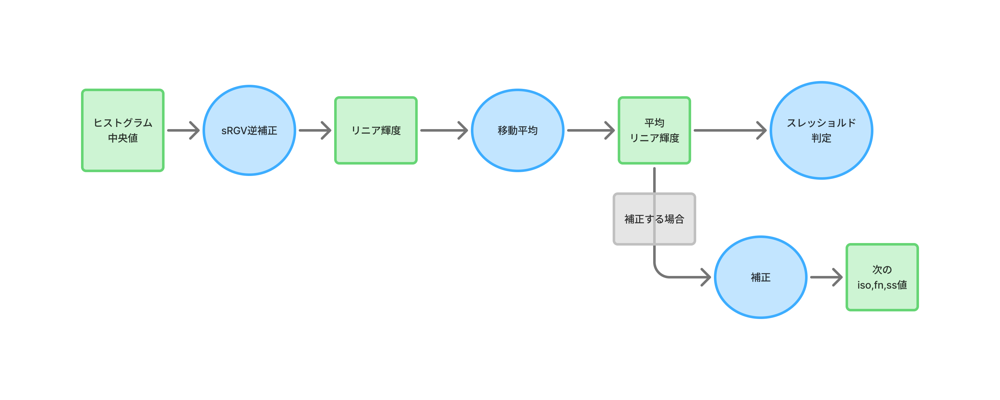
Figma: https://www.figma.com/board/ReHOSDYTqfaFPF9TWhFhZx/flow%E9%9C%B2%E5%87%BA%E8%A3%9C%E6%AD%A3?t=mx7wzmihBOpdJbj7-0  

### **4.6. カメラ設定**
カメラの設定をholyGrail撮影に適したものに変更する。  
変更する設定は保存しておき終了時に元に戻す。  
撮影時の設定を以下に示す。  
- iso設定段数 1/3
- ss設定段数 1/3
- fn設定段数 1/3

### **4.7. 接続方法**
スマートフォンが直接カメラを制御することは可能。  
この場合複数の撮影計画を並行して実行することも可能。  
エッジ端末に撮影計画を託して撮影することが可能。  
エッジ端末に託した撮影計画の進捗だけを受け取って表示することができる。  
エッジ端末が別のエッジ端末に撮影計画を託すことはできない。  
スマートフォンが複数のエッジ端末に撮影計画を託すことも可能。  

#### **4.8. 自動露出の開始**
撮影が継続している状況で撮影制御方法が変わるとき不連続が起きないように対処する。  
朝日撮影、夕日撮影、日中撮影の自動露出の撮影制御方法は最初に直前の iso、ss,fn での APEX を算出する。  
自分の iso,ss,fn の初期値から優先度に従って変化させ、同じ APEX になるように設定をし撮影を開始する。  

#### **4.9. 撮影とデータ処理タイミング**

## **6.各デバイスの役割**

### **6.1.スマートホン**

・撮影計画の編集をおこなう  
・撮影制御方法の編集をおこなう  
・カメラに直接撮影の開始／停止指示をおこなう  
・エッジ端末経由で開始／停止指示をおこなう  
・撮影計画を実行する  
・エッジ端末に撮影計画を送る  
・エッジ端末のアプリを書き換える  
・地磁気センサーを使用し撮影方位を取得する  
・加速度センサーを使用し仰角を取得する  
・インターネットに接続し地図アプリから撮影場所の緯度経度、標高を取得する  
・GPS情報から現在位置の緯度経度、標高を取得する  

### **6.2.エッジ端末**

・撮影制御方法を受け取る  
・撮影計画を実行する  
・撮影の開始／停止をおこなう  
・スマートフォンからの指示で撮影の開始／停止をおこなう  
・インターネットに接続し自身のアップグレードをおこなう  
・地磁気センサーを使用し撮影方位を取得する  
・加速度センサーを使用し仰角を取得する

## **7.ユーザーインターフェース**
### **7.1.概要**  
### **7.1.1.画面遷移**  
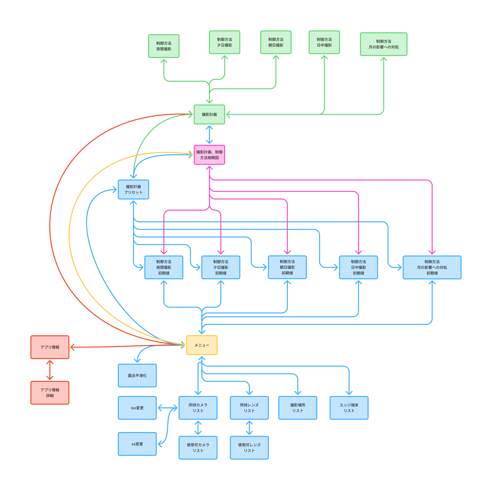
Figma: https://www.figma.com/board/DuQt9OzKxbRddKashj5GyL/flow%E7%94%BB%E9%9D%A2%E9%81%B7%E7%A7%BB?node-id=0-1  

### **7.1.2.各画面に共通する事**  
画面の内容は縦に入りきらない場合は画面全体をスクロールする。  
各画面の上部のタイトルとアイコンスペースはスクロールせず画面上部にとどまる。  

  戻るアイコンは表示元の画面に戻る。  
&emsp;popup メニューから表示した場合はpopupではなくその表示元に戻る。  

  メニューアイコンはメニュー画面を表示する。  

　「設定」アイコンは関連する設定画面に遷移する。  

### **7.2.メニュー**  
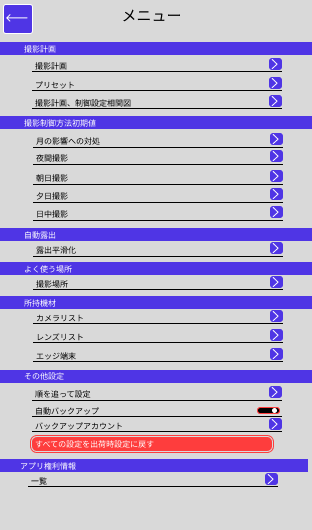
Figma: https://www.figma.com/design/dqndmpQJ4P2OVxXscrKaY4/HolyGrailController?node-id=63-773  

### **7.3.撮影計画**  
#### **7.3.1.撮影計画**  
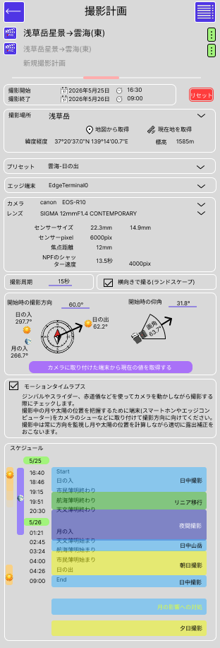
Figma: https://www.figma.com/design/dqndmpQJ4P2OVxXscrKaY4/HolyGrailController?node-id=30-409  
■名称  
撮影計画の名称は自由に設定できる。  
撮影計画の名称をスクロールして他の撮影計画の名称を表示できる。  
タップするとその撮影計画が大きく表示され、内容が下のプレーンに表示される。  

■  アイコン
Figma: https://www.figma.com/design/dqndmpQJ4P2OVxXscrKaY4/HolyGrailController?node-id=249-1665  
撮影開始アイコンである。
タップすると撮影を開始する。
撮影中はカメラアイコンが点滅する。

■  アイコン
Figma: https://www.figma.com/design/dqndmpQJ4P2OVxXscrKaY4/HolyGrailController?node-id=255-1746  
コンテキストメニューを表示する。
撮影開始前のコンテキストメニューは以下項目である。  
- 削除  
- コピーを追加  

■撮影開始、撮影終了  
　撮影開始、終了の日時を設定する。  
　カレンダーと時計アイコンのタップでピッカーが表示される。  
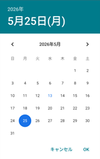  
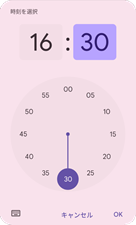  

■撮影場所  
撮影場所の緯度、経度、標高を設定する。  
地図アプリから取得することが可能である。  
GPS情報から現在地を設定することが可能である。  
数値をタップすると直接入力ポップアップが表示される。  
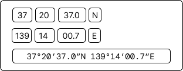
Figma: https://www.figma.com/design/dqndmpQJ4P2OVxXscrKaY4/HolyGrailController?node-id=251-2064  
緯度経度の度分秒形式と連続した領域への入力も可能である。  
10進法で入力した文字列も解釈し度分秒形式に変換する。  
地図アプリなどからの貼り付けも可能とする。  

■標高
標高をタップするとキーボードが表示され直接数値を入力できる。  

■プリセット  
元になる撮影計画のプリセットである。  
ドロップダウンマークタップで撮影計画プリセット選択のコンテキストメニューを表示する。  
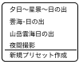
Figma: https://www.figma.com/design/dqndmpQJ4P2OVxXscrKaY4/HolyGrailController?node-id=244-1503  
別のプリセットを選択すると今まで編集した内容は破棄されるので以下の確認ポップアップを表示して確認する。  
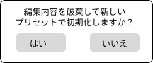
Figma: https://www.figma.com/design/dqndmpQJ4P2OVxXscrKaY4/HolyGrailController?node-id=264-1854  
「はい」を選択すると内容を破棄して指定したプリセットで初期化する。  
「新規プリセット作成」を選択すると出荷時設定で初期化する。  

■カメラ、レンズ  
プリセットで選択したカメラ、レンズが初期値として表示される。  
変更する際にはドロップダウンアイコンをタップする。  
使用するカメラとレンズを機材リストから選択する。  
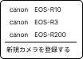
Figma: https://www.figma.com/design/dqndmpQJ4P2OVxXscrKaY4/HolyGrailController?node-id=123-965  
カメラ名称をタップすると所持カメラに登録したカメラ一覧のピッカーを表示する。  
一覧から使用カメラを選択する。  
同様にレンズも一覧から選択する。    

■センサーレンズの定数を変更する  
カメラとレンズのセンサーサイズ、センサーpixel、焦点距離は機材リストから取得した数値を表示している。  
これらの数値を変更する場合や機材リストにない機材を使用する際にここをチェックしてこれらの数値を変更する。  
数値を変更する際にはキーボードが表示される。  
NPF のシャッター速度は自動計算する。　　
この数値は参考に表示しているだけで制御には影響しない。  

■撮影周期  
撮影計画の中で最大のss+2秒を初期値として表示する。  
数値をタップするとキーボードが表示される。  
撮影制御方法の最長のシャッター速度+2秒の撮影周期を維持する。  
撮影制御方法でこれより長いシャッター速度を指定した際は撮影周期を自動的にシャッター速度+2秒に伸ばす。
撮影周期を撮影制御方法最長のss+2より小さく設定しようとする場合は「先にシャッター速度を変更してください」の警告を表示し変更できない。  

■横向きで撮る(ランドスケープ)  
NPFのシャッター速度や画角に入る月や太陽の位置計算で使用する。  

■開始時の撮影方向  
開始時の撮影方向を指定する。  
撮影計画はこの方向で撮影を継続する前提で作成する。  
撮影開始から撮影終了までの間に日の出、日の入り、月の出、月の入りが発生する場合はアイコンと文字で情報を表示する。  
月のアイコンは月齢に応じた物を表示する。  
「モーションタイムラプス」設定時は端末からの情報で状況に応じて撮影計画を変更する。  
方位磁石についている矢印を磁石の円周にそってスライドさせる。  
設定できる方位は0.0°～359.0°。  
スライドで設定できる角度は1°単位。  
小数点以下を指定する場合は数字をタップしてキーボードで入力する。  

■開始時の仰角  
カメラのアイコンは「横向きで撮る(ランドスケープ)」のチェックに応じて向きが変化する。  
画角の角度はセンサーサイズ、焦点距離、「横向きで撮る(ランドスケープ)」の設定で自動計算する。  
画角の扇形にも反映する。  
「開始時の撮影方向」と同様に開始時の仰角を指定する。  
カメラが向いている方向の矢印を弧を描くようにスライドさせる。  
設定できる角度は90.0°～-90.0°。  
スライドで指定できる角度の分解能は1°単位。  
小数点以下を設定したい場合は角度の数値をタップしてキーボード入力する。  

「カメラに取り付けた端末から現在の値を取得する」ボタンの押下で、  
端末から取得した値を「開始時の撮影方向」に反映する。  
仰角はカメラから取得する。  

■モーションタイムラプス  
チェックをすると撮影中に端末から撮影方向、仰角を取得する。  
月や太陽の影響をリアルタイムに計測しながら撮影をおこなう。  
端末をカメラに固定する必要がある。  
1台の端末で制御できるカメラは1台に制限される。  

■スケジュール  
開始時のカメラの方角に応じた撮影スケジュールを自動作成し表示する。    
スケジュールは撮影制御方法の組み合わせとなる。  
モーションタイムラプス指定時は状況に応じてスケジュールは変わる。  
撮影スケジュール全体にかかわる「月の影響への対処」やモーションタイムラプス設定時に必要となる可能性のある撮影制御方法をスケジュールの下に表示する。  
これらの撮影制御方法をタップして詳細な設定がおこなえる。  
撮影制御方法については別途「[7.4.撮影制御方法](#74撮影制御方法)」で説明する。  
スケジュールには日の出入り、月の出入り、薄明の状況に関する時刻が表示される。  
また、日の出入り、月の出入りに関しては図でも表示する。  
月のアイコンは月齢に応じた形で表示する。  

#### **7.3.3.撮影中**  
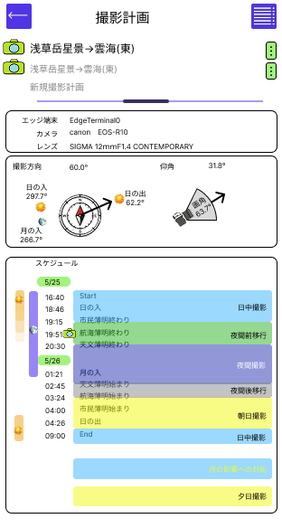
Figma: https://www.figma.com/design/dqndmpQJ4P2OVxXscrKaY4/HolyGrailController?node-id=67-530  
撮影中は現在の状況を知る最低限の情報だけを表示する。  
カメラアイコンが撮影計画の名称部とスケジュールの現在位置で点滅する。  
撮影中の撮影計画については変更できない。
スケジュールの現在位置でもカメラアイコンが点滅する。  
モーションタイムラプス設定時は現在の撮影方向、仰角はリアルタイムに表示する。  

### **7.4.撮影計画個別の撮影制御方法**  
#### **7.4.1.概要**  
撮影計画のスケジュールにある撮影制御方法の詳細を変更する。  
撮影計画新規作成時はユーザーが設定した初期値の撮影制御方法が設定されている。  
撮影目的や環境、その作品の独自設定などを反映することが可能である。  
撮影制御方法には以下がある。  
　■夜間撮影  
　■朝日撮影  
　■夕日撮影  
　■月の影響への対処  
　■日中撮影  　
　■夜間前移行  
　■夜間後移行  

#### **7.4.2.夜間撮影**  
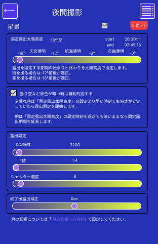
Figma: https://www.figma.com/design/dqndmpQJ4P2OVxXscrKaY4/HolyGrailController?node-id=1-2058  
夜間撮影は明るさが変わらないものとして固定露出設定でおこなう。  

■撮影制御方法名称  
設定で登録したユーザー定義の撮影制御方法から選択できる。  
撮影計画ごとに個別に変更ができる。  

■リセット  
変更した内容を取り消し、初期値として設定した内容に戻す。  

■固定露出太陽高度  
自動露出から固定露出に切り替える時刻は撮影対象によって変えることが望ましい。   
星景撮影時は夜の天文薄明と朝の天文薄明の間が良い。  
街の夜景を撮影する場合には航海薄明と天文薄明の間で固定することが望ましい。  
ユーザーには薄明の状態を表す太陽高度で指定してもらう。  
太陽高度は-5°から-19°の間で設定が可能である。  
ソフトウェアは太陽高度から日時に応じた時刻を算出しその時刻で撮影制御方法を切り替える。  
スライダーでは1°単位での指定が可能である。  
数値は度分で表示する。  
分単位の数値を指定する場合には数値をタップしてキーボードで度、分それぞれの数値が変更できる。  
度と分の2つの入力領域とキーボードを表示する。  
数字だけを入力してキーボードを閉じるか画面の他の部分をタップすると元の画面に戻る。  

■曇り空など、空が暗い時は自動判別する  
曇り空の場合は夕方は早く暗くなり、朝は暗い時間が長引く。  
そのような場合に備えて自動で判別するチェックを設ける。  
自動判別にすると、夕方は指定した薄明の状態より前の時刻に暗さの変化が止まる。  
その際に固定露出に切り替える。  
逆に朝は明るくなってきたと判断したら固定露出から自動露出に切り替える。  
安定したかどうかの判定は露出平滑化の設定に準じる。  

■露出設定  
指定したISO感度、F値、シャッター速度で固定露出とする。  
ここで設定したISO感度、F値、シャッター速度は他の撮影制御方法も含めた全体の明るい方向の限界値となる。  
夜間撮影のシャッター速度は撮影周期-2以内であることを守る。  
撮影周期-2を超える設定をした場合は撮影周期が自動的に+2秒に変更される。  
キーボードでの入力はできない。  

■終了後露出補正  
夜間撮影と次の撮影制御方法の間の露出補正目標を設定します。  
夜間に星を撮影していてその方向に朝日が昇ってくるとすると朝日撮影は暗めで撮るのが美しい。  
その暗めの設定で日が昇るまでの間の撮影をおこなうとほぼ真っ暗な景色となってしまう。  
そのためその間の露出設定を朝日を撮るよりも明るく撮りたい場合があるので分けて露出設定を行えるようにする。  

#### **7.4.3.夕日撮影**  　
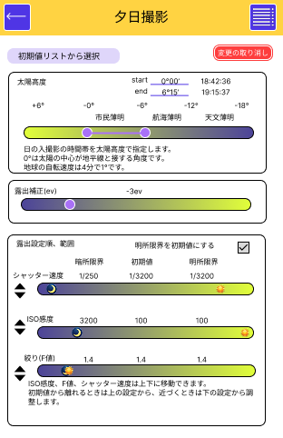
Figma: https://www.figma.com/design/dqndmpQJ4P2OVxXscrKaY4/HolyGrailController?node-id=4-328  
夕日を直接撮影する場合は暗めに撮影すると太陽の色の変化が撮れる。  
一方、暗く撮影するため景色は黒くつぶれてしまう。  
この匙加減が撮影者の個性や作品の味となるためユーザーが調整をする。  
明るさが刻一刻と変わる時間帯なので自動露出補正で撮影する。  

■リセット  
変更した内容を取り消し、ユーザープリセットに戻す。  

■太陽高度  
夕日撮影の薄明の状態を太陽高度で指定する。  
初期値は市民薄明と航海薄明の間の-6°となる。  
日時からこの太陽高度となる時刻を算出する。  
「夕日撮影」は太陽が画角に入ったところからこの設定を開始する。  
終了はこの時刻までとする。  
「夕日撮影」はこの時刻から開始し画角に太陽が入っている間は継続する。  

■露出補正  
露出補正を指定する。  
初期値は-3.0である。  
スライダーで変更でき、範囲は-5.0～+5.0である。  
刻みは1/3なので小数点以下の表示は0.0、0.3、0.7、1.0…となる。  

■露出限界  
ISO感度、F値、ssの限界の設定値を指定する。  
項目を上下に移動し優先度を決める。  
最上の項目の設定が限界に達するとその下の段の設定を変更する。  
例えば日の出時刻で太陽の光条を出したい場合はF値を先頭に持っていき優先的に変化させる。  
周辺減光の違いを気にする場合はF値を最下段に持っていき優先度を下げる。  
ISO感度を優先にすればISO感度を速めに下げてノイズの少ない画質を優先することができる。  

#### **7.4.4.朝日撮影**  　
夕日撮影と太陽高度設定の時系列が逆となる。  
内容は夕日撮影と同様である。  

#### **7.4.5.日中撮影**  
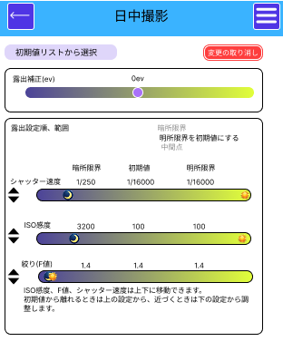
Figma: https://www.figma.com/design/dqndmpQJ4P2OVxXscrKaY4/HolyGrailController?node-id=82-625  
■露出補正
露出補正を指定する。  
初期値は-0.0である。  
スライダーで変更でき、範囲は-5.0～+5.0である。  
刻みは1/3なので小数点以下の表示は0.0、0.3、0.7、1.0…となる。  

■露出限界  
ISO感度、F値、ssの限界の設定値を指定する。  
項目を上下に移動し優先度を決める。  
最上の項目の設定が限界に達するとその下の段の設定を変更する。  
例えば日の出時刻で太陽の光条を出したい場合はF値を先頭に持っていき優先的に変化させる。  
周辺減光の違いを気にする場合はF値を最下段に持っていき優先度を下げる。  
ISO感度を優先にすればISO感度を速めに下げてノイズの少ない画質を優先することができる。  

#### **7.4.6.月の影響への対処**  
初めに以下の3つの選択肢から選択する。  
・補正しない  
・画角全体の明るさで自動補正をする  
・月自体を撮影する目的で月に露出を合わせる  

■補正しない  
星景撮影時に月の位置を意識することなく星景の露出設定で撮影を継続する。  

■画角全体の明るさで自動補正をする  
夜間撮影中もライブビュー画像の明るさを評価し一定の明るさの変化があれば自動で補正をおこなう。  

■月自体を撮影する目的で月に露出を合わせる  
撮影地の緯度、経度、標高と撮影時刻、撮影方向から月の位置を把握する。
月が画角に入るときは月を撮る目的であらかじめ計算した露出補正値に近づくように制御する。 

#### **7.4.7.月の影響への対処(画角全体の明るさで自動補正をする)**  
.png)
Figma: https://www.figma.com/design/dqndmpQJ4P2OVxXscrKaY4/HolyGrailController?node-id=20-224  

■リセット  
変更した内容を取り消し、ユーザープリセットに戻す。  

■露出補正を開始する撮影対象の輝度  
夜間撮影中の輝度を0evとした際の撮影対象の輝度変化があれば自動補正を開始する。  
設定できる範囲は0ev～+3ev。  

■露出補正  
画角全体の光量で露出補正をおこないここで指定した露出補正値に近づくように制御をおこなう。  
設定できる範囲は0～-10ev。  

■露出限界  
露出設定の明るい側と暗い側の限界の設定をおこなう。  
また、露出設定の ISO、F値、シャッター速度 のどれを先に変化させるかを指定する。  
指定は項目自体を上下することにより行う。  
最上段の項目を先に変更し、限界値になるとその下の段の項目で露出補正をおこなう。  
 
#### **7.4.8.月の影響への対処(月自体を撮影する目的で月に露出を合わせる)**  
.png)
Figma: https://www.figma.com/design/dqndmpQJ4P2OVxXscrKaY4/HolyGrailController?node-id=4-401  

■リセット  
変更した内容を取り消し、初期値として設定した内容に戻す。  

■H-G関数のグラフ  
撮影開始と終了の日時から月齢を算出しグラフにマークする。  
開始時の月の明るさを等級で表示する。  

■開始時露出設定  
H-Gグラフから算出した撮影開始時の露出設定を初期値として表示する。  
数値をタップして数値を変更することができる。  

■大気消光補正をする  
月が低い位置にある際は空気の層が厚くなるため暗くなる。  
月の高度が低い時は暗い月を撮れるように補正をおこなう。  
Hardieの公式で大気消光補正をおこなう。  
大気消光係数は真上の大気が一番薄い部分で何等級ぶん暗くするかという数値である。  
0.1～0.6の間で設定する。  
大気の状態に応じて設定する。  

■地心距離補正をする  
月と地球の距離は常に一定ではない。  
そのため近い時は明るく、遠い時は暗くなる。  
平均的な月の距離との差に応じて露出補正をおこなう。  

■月周辺の空の明るさ補正の係数  
月が画角に入っていないときの撮影方向の空の明るさを「クリスティアン・プレッシャー（Krisciunas）のモデル」で算出する。  
撮影方向の空が月の影響を受けて明るくなっているときその明るさに応じて露出調整をおこなう。  
その影響度の係数をここで設定する。  
100%の場合は補正値をすべて使用した露出補正とする。  
0%の場合は月の影響による空の明るさに関する補正をおこなわない。  
撮影目的に応じて調整する。  

#### **7.4.9.夜間前以降**  
夜間前以降の撮影制御方法の設定は特にない。  
夜間前以降中は前の撮影制御方法から夜間撮影へなめらかに移行するように露出設定を制御する。  

#### **7.4.10.夜間後移行**  
夜間撮影で「夜間後露出補正(終了後露出補正)」を指定する。  
夜間撮影が終了してから次の撮影制御方法に移行するまでの間を、測光による自動露出で制御する。  
露出の上限を夜間の固定露出にクランプし、下限・初期値・優先度は次の撮影制御方法に合わせ、ここで指定した「夜間後露出補正」を目標evとする(次の撮影制御方法のevとは別)。  
夜間露出から始まり、明るくなった分だけ露出を下げていく(暗いうちは夜間露出のまま)。  

### **7.6.撮影制御方法初期値**  
撮影計画からの撮影制御方法指定の初期値をここで設定する。  
撮影制御方法と説明が重複するのでここでは設定だけでおこなう部分について説明する。  

#### **7.6.1.月の影響への対処の初期値**  
.png)
Figma: https://www.figma.com/design/dqndmpQJ4P2OVxXscrKaY4/HolyGrailController?node-id=62-597  

■リセット  
月の影響への対処の初期値を出荷時設定に戻す。  

■満月露出設定  
月が最も明るいときに月を撮影する際の露出設定をおこなう。  
このグラフは横を月齢とし縦に月の明るさを表す等級をプロットしたグラフである。  
満月の最も明るい瞬間を-12.7等級としている。  
満月と夜間撮影線の間をグラフのカーブに応じて算出し撮影計画の初期値として反映する。  

■夜間撮影線  
細く暗い月に露出を合わせると景色や空が明るくなりすぎてしまう。  
それを避けるために一定程度の暗さであれば露出補正をおこなわず夜間撮影の露出設定で撮影をおこなう。  
その位置をこの点線で指定する。  
点線を上下して自動露出補正をおこなわない月齢と等級を決める。  

#### **7.6.2.夜間撮影の初期値**  
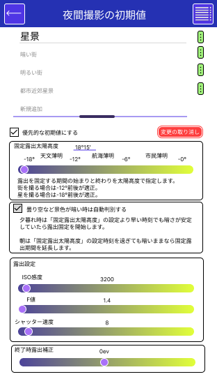
Figma: https://www.figma.com/design/dqndmpQJ4P2OVxXscrKaY4/HolyGrailController?node-id=64-824  
■名称  
複数のプリセットを登録することができる。  
プリセットは上下に移動することができる。  
選択したプリセットの名称が大きな文字で表示され、内容が下のプレーンに表示される。  

■撮影計画に自動的に挿入する  
プリセットのうち1つだけチェックを入れられる。  
チェックを入れたプリセットは撮影計画生成時に最初に選択される。  

■色の設定  
この画面の背景の色と撮影計画のスケジュールに挿入される色を指定する。  
プリセットごとに指定できる。  
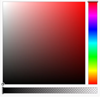  

■自動露出太陽高度
夜間撮影開始、終了の薄明の状態を角度で設定する。  

■リセット  
選択しているプリセットの内容を出荷時設定に戻す。  

#### **7.6.3.夕日撮影の初期値**  
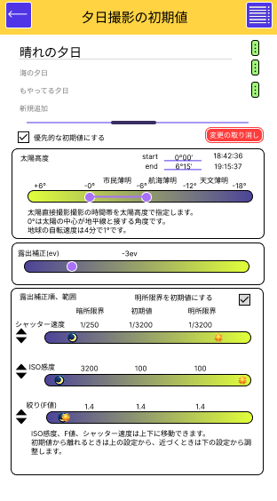
Figma: https://www.figma.com/design/dqndmpQJ4P2OVxXscrKaY4/HolyGrailController?node-id=75-599  
■名称
選択したプリセットが大きな文字で表示され、内容が下のプレーンに表示される。  

■色の設定
この画面の背景と撮影計画のスケージュールに表示される色を指定する。  
タップすると Color Picker が表示される。  

■リセット
タップすると出荷時の設定に初期化される。  

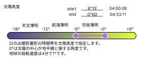
Figma: https://www.figma.com/design/dqndmpQJ4P2OVxXscrKaY4/HolyGrailController?node-id=100-982  
朝日撮影は時系列が夕方と逆になるので「太陽高度」のスライドバーの左右を逆にする。  
その他は夕日撮影と同様である。  

#### **7.6.4.日中撮影の初期値**  
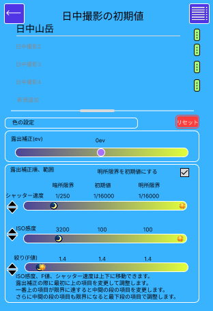
Figma: https://www.figma.com/design/dqndmpQJ4P2OVxXscrKaY4/HolyGrailController?node-id=82-689  
■名称
選択したプリセットが大きな文字で表示され、内容が下のプレーンに表示される。  

■露出

### **7.7.露出平滑化**  
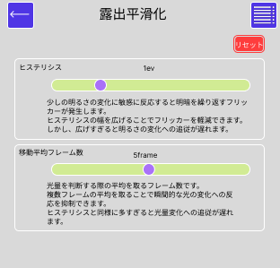
Figma: https://www.figma.com/design/dqndmpQJ4P2OVxXscrKaY4/HolyGrailController?node-id=66-494&t=gP65u3UgJmLKv9kX-0  

■リセット  
「露出平滑化」を出荷時設定に戻す。  

■露出平滑化ヒステリシス  
フリッカーを防ぐための上下限の幅。  
デフォルトは1段。  
⅓段〜3段の幅で設定可能。

■露出平滑化移動平均フレーム数  
露出平滑化する際の明るさを判定する移動平均のフレーム数。  
フレーム数が多いほどノイズ的な瞬時の明るさ変化への反応が鈍くなる。  
半面空の明るさが急激に変化する際には追従が遅くなる。  
設定可能範囲は1～10フレーム。  
デフォルトは5フレーム。

### **7.8.所持機材**  
#### **7.8.1.所持カメラリスト**  
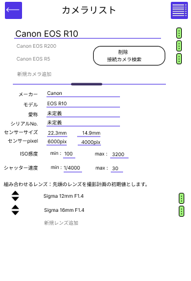
Figma: https://www.figma.com/design/dqndmpQJ4P2OVxXscrKaY4/HolyGrailController?node-id=127-944  
撮影計画に設定できるカメラを登録する。  
「新規カメラ追加」をタップすると設定可能なカメラのリストが表示される。  
対応可能なカメラのリストから所持しているカメラを選択して設定する。  
登録されているカメラをタップすると文字が大きくなって下に仕様が表示される。  
さらに名前をタップして変更することができる。  
「接続カメラ検索」で現在ネットワークに接続されているカメラを検索することができる。  

■撮影計画に自動的に挿入する  
チェックを入れると撮影計画を新規作成した際に選択される。  

■カメラの規定項目
以下項目はカメラの仕様である。  
変更して新たなカメラとすることも可能である。  
- メーカー
- モデル
- センサーサイズ
- センサーpixel
- ISO感度
- シャッター速度

■組み合わせるレンズ
所持レンズリストから選択して登録する。  
撮影計画でこのカメラを選択した際に選択できる。  
先頭のレンズが初期値として表示される。  
「新規レンズ追加」で以下ポップアップよりレンズリストに登録したレンズから選択できる。  
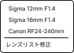
Figma: https://www.figma.com/design/dqndmpQJ4P2OVxXscrKaY4/HolyGrailController?node-id=221-1491  
「レンズリスト修正」の選択で所持レンズリスト画面を表示する。  

#### **7.8.2.使用可能カメラリスト**  
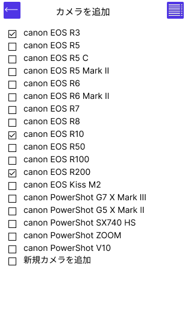
Figma: https://www.figma.com/design/dqndmpQJ4P2OVxXscrKaY4/HolyGrailController?node-id=181-1231  
使用可能なカメラの一覧を表示する。  
撮影に使用するカメラを選択して所持カメラリストに登録する。  
複数選択が可能。
「新規カメラを追加」にチェックを入れてリストにないカメラを追加することができる。  

#### **7.8.3.所持レンズリスト**  
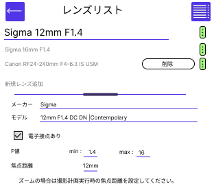
Figma: https://www.figma.com/design/dqndmpQJ4P2OVxXscrKaY4/HolyGrailController?node-id=135-1004  
撮影計画に設定できるレンズを登録する。  
「新規レンズ追加」をタップすると設定可能なレンズのリストが表示される。  
対応可能なレンズのリストから所持しているレンズを選択して設定する。  
登録されているレンズをタップすると文字が大きくなって下に仕様が表示される。  
さらに名前をタップして変更することができる。  

#### **7.8.4.使用可レンズリスト**  
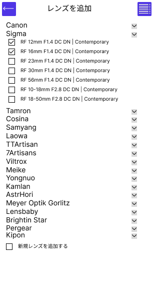
Figma: https://www.figma.com/design/dqndmpQJ4P2OVxXscrKaY4/HolyGrailController?node-id=182-1461  
使用可能なレンズを選択する。  
レンズは数が多いのでメーカーごとに選択できるようにする。  
「新規レンズを追加」にチェックを入れてリストにないレンズを追加することができる。  

#### **7.8.5.所持エッジ端末**  
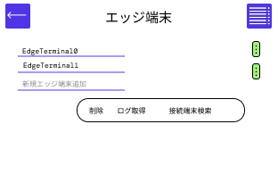
Figma: https://www.figma.com/design/dqndmpQJ4P2OVxXscrKaY4/HolyGrailController?node-id=170-1422  
使用するエッジ端末の名称を登録する。  
「新規エッジ端末」をタップして名称をキーボード入力する。
「接続端末検索」で現在ネットワークに接続されている端末を検索することができる。  

### **7.9.撮影場所**  
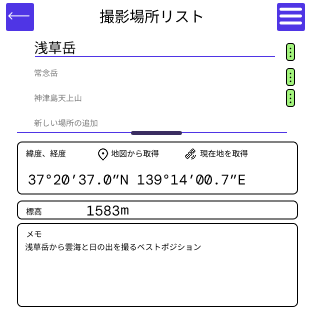
Figma: https://www.figma.com/design/dqndmpQJ4P2OVxXscrKaY4/HolyGrailController?node-id=130-1165  
撮影場所をあらかじめ登録しておく。  
複数の撮影場所を登録し撮影計画で選択できるようにする。  

■新しい場所の追加
新規場所を追加することができる。

■撮影計画に自動的に挿入する
新規に撮影計画を作成した際にチェックした撮影場所を初期値として挿入する。  

■位置情報
緯度、経度、標高を設定する。  
地図アプリからの登録、スマートフォンの位置情報からの登録が可能。  

### **7.10.撮影計画、制御設定相関図**  
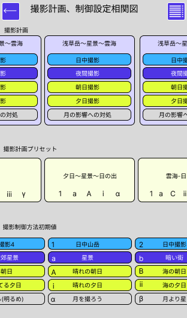
Figma: https://www.figma.com/design/dqndmpQJ4P2OVxXscrKaY4/HolyGrailController?node-id=256-1855  
撮影計画、撮影制御方法とそれらのプリセットの相関を分かりやすく図解したものである。  
データの関係を明らかにし編集したいデータの検索を容易にする。  

■撮影計画  
撮影計画は名前を付けて複数作成できる。  
撮影計画に撮影制御方法が含まれている図である。  
左右にスクロールして目的の撮影計画を探すことができる。  
それぞれの撮影計画の中には撮影制御方法が含まれている。  
これらをタップして目的の撮影計画、撮影制御方法の編集画面に遷移することができる。  

■撮影計画プリセット  
撮影計画プリセットも同様に複数あるので左右にスクロールして検索する。  
撮影計画プリセットの撮影制御方法は名称だけが関連付けられている。  
どの撮影制御方法を使用するかを「1,2,3,…」、「a,b,c,…」、「A,B,C,…」、「ⅰ,ⅱ,ⅲ,…」、「α,β,γ,…」の記号であらわしている。  
これらの記号は次の撮影制御方法プリセットに関連付けられる。  
タップで撮影計画プリセットの編集画面に遷移する。  

■撮影制御方法初期値  
日中撮影、夜間撮影、朝日撮影、夕日撮影、月への影響の対処それぞれの撮影制御方法の初期値を表示する。  
初期値の名前と撮影計画プリセットで関連付けられた記号を表示する。  
これらも左右のスクロールで検索できる。  
タップで撮影制御方法初期値の編集画面に遷移する。  

## **8.エッジ端末**  
###**8.1.スマートフォンとの違い**  
エッジ端末は画面が小さい事、リソースが限られていることから撮影の開始/停止と撮影計画の参照だけをおこなえることとする。  

#### **8.1.1.撮影計画取得方法**  
スマートフォンからネットワーク経由で撮影計画を受信する。  

#### **8.1.2.エッジ端末画面遷移**  
.png)
Figma: https://www.figma.com/board/WQhYf8RKPiRMDH78ek4USs/flow%E7%94%BB%E9%9D%A2%E9%81%B7%E7%A7%BB-%E3%82%A8%E3%83%83%E3%82%B8%E7%AB%AF%E6%9C%AB-?t=mx7wzmihBOpdJbj7-0  
エッジ端末の画面遷移である。  
撮影計画にかかわる表示とエッジ端末固有の設定で構成される。  

### **8.2.撮影計画**  
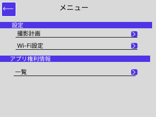
Figma: https://www.figma.com/design/dqndmpQJ4P2OVxXscrKaY4/HolyGrailController?node-id=265-1854  
スマートフォンから受信した撮影計画を表示する。  
スマートフォンからの指示で撮影開始/停止をおこなう。  
エッジ端末の画面でも撮影開始/停止がおこなえる。  
それ以外の項目の変更はできないこととする。  

### **8.3.撮影制御方法**  
撮影計画固有の撮影制御方法の参照も行える。  
参照のみで変更は一切おこなえない。  
そのため、リセットボタンは無い。  
ドロップダウンのアイコンやコンテキストメニューのアイコンも存在しない。  
露出設定を上下に移動するアイコンも存在しない。  

### **8.4.Wi-Fi設定**  
#### **8.4.1.自分をAPとする設定**  
.png)
Figma: https://www.figma.com/design/dqndmpQJ4P2OVxXscrKaY4/HolyGrailController?node-id=182-1721  
エッジ端末をAPとする際のFi-Fi設定である。  
SSID を決める。  
カメラやスマートフォンが接続する際のパスワードを指定する。  
エッジ端末を区別するために名称を決める。  

#### **8.4.2.他のAPに接続するる設定**  
.png)
Figma: https://www.figma.com/design/dqndmpQJ4P2OVxXscrKaY4/HolyGrailController?node-id=183-1782  
他の装置をAPとした際に接続しに行く際の設定である。  
接続先のSSIDとそのパスワードを設定する。  
エッジ端末区別のための名称を設定する。  

